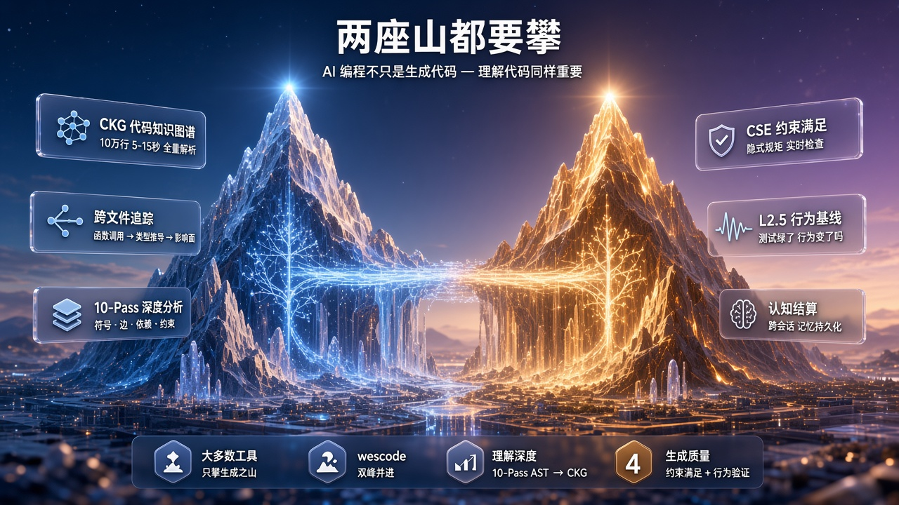
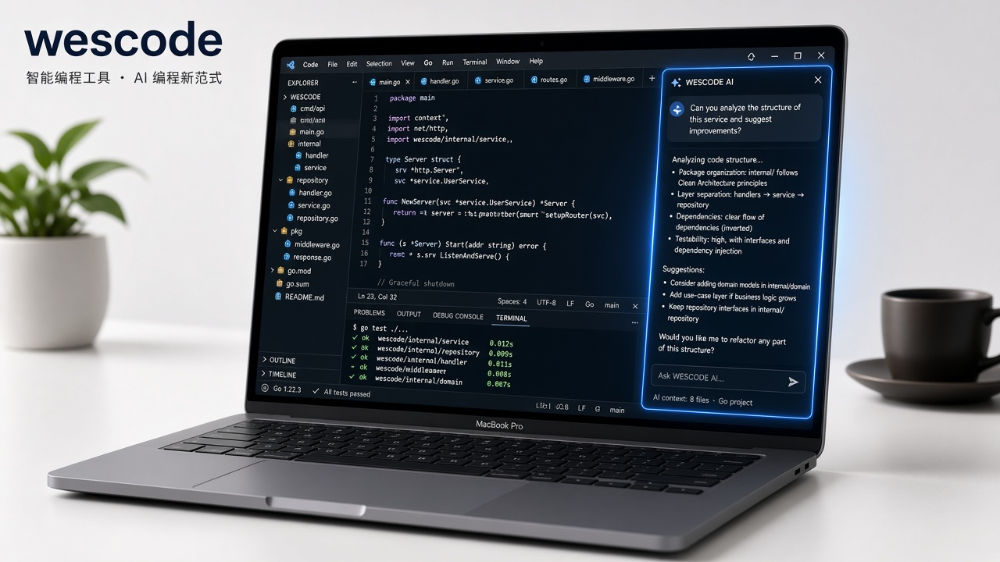
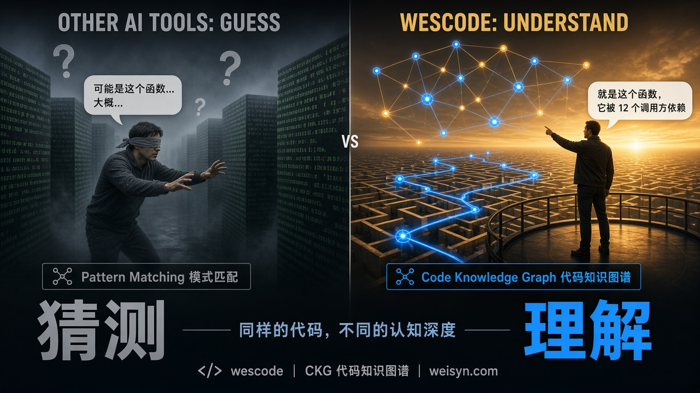
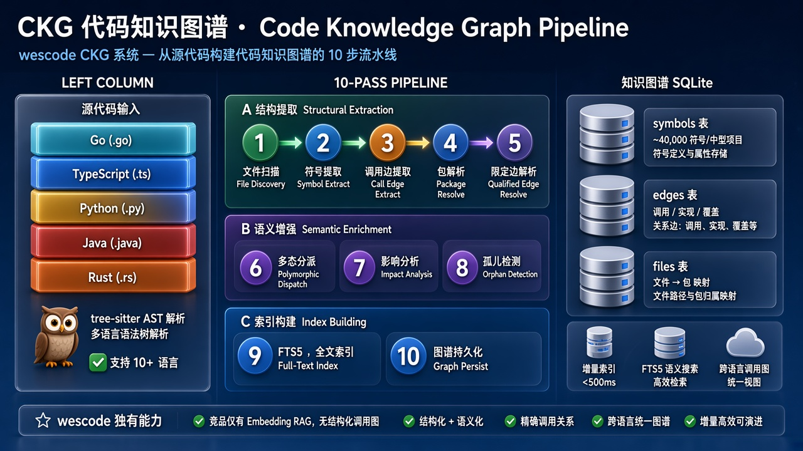
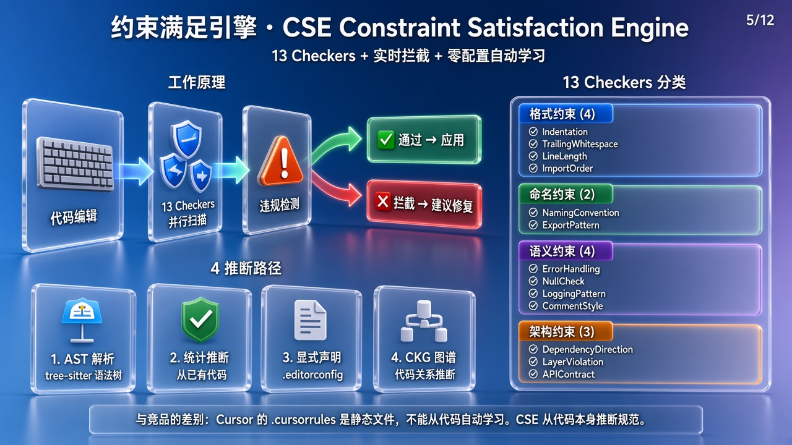
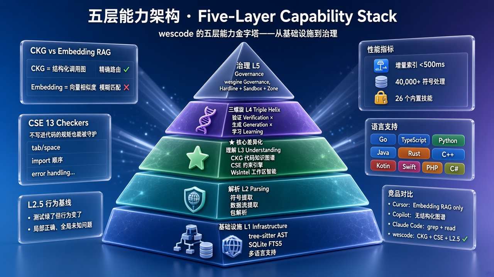
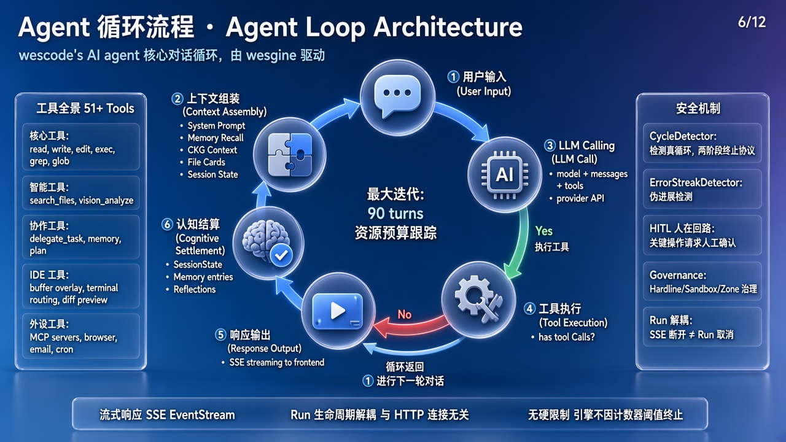
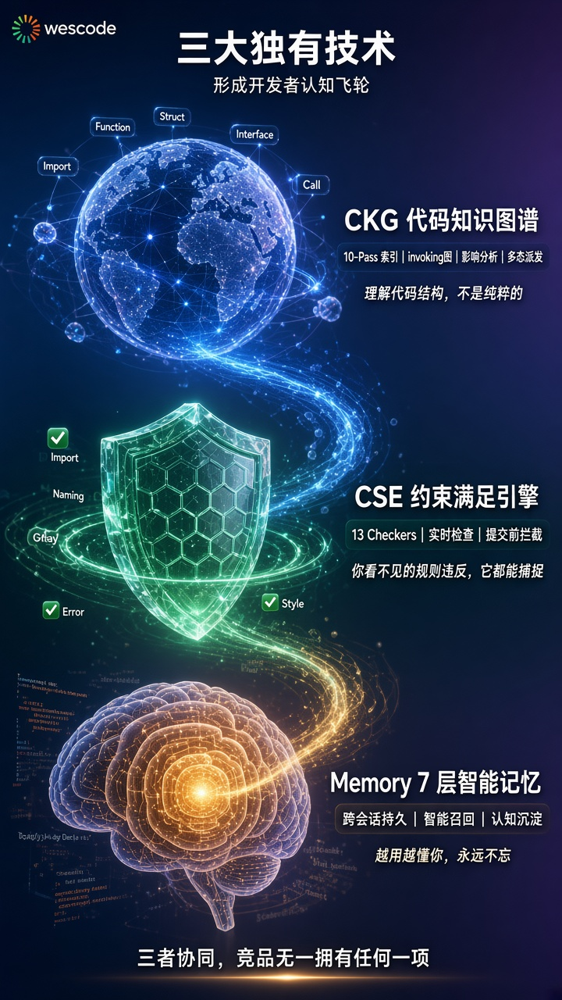

<p align="center">
  
</p>

<h1 align="center">WES Code</h1>

<p align="center">
  <strong>AI 原生智能编程工具</strong> — 基于 VS Code 构建的桌面应用，用代码知识图谱替代暴力搜索。
</p>

<p align="center">
  <a href="https://www.weisyn.com"></a>
  <a href="https://www.weisyn.com/download/wescode"></a>
  <a href="https://www.weisyn.com/docs/wescode/quickstart"></a>
</p>

<p align="center">
  
  
  
  
</p>

---

## ⬇️ 下载安装

WES Code 是一个**开箱即用的桌面应用**，下载安装即可使用：

| 平台 | 架构 | 下载 |
|------|------|------|
| **macOS** | Apple Silicon (M1/M2/M3/M4) | [📦 下载 .dmg](https://www.weisyn.com/api/downloads/wescode/file/darwin-arm64) |
| **macOS** | Intel | [📦 下载 .dmg](https://www.weisyn.com/api/downloads/wescode/file/darwin-amd64) |
| **Windows** | x64 | [📦 下载安装包](https://www.weisyn.com/api/downloads/wescode/file/windows-amd64) |

> 📖 也可以访问 [下载页面](https://www.weisyn.com/download/wescode) 查看版本详情与更新日志。

### 首次使用

1. **下载安装** — macOS 双击 `.dmg` 拖入应用文件夹；Windows 运行安装程序
2. **添加模型** — 启动后点击左侧 ⚡ 图标，添加 LLM Provider（推荐 [DeepSeek](https://platform.deepseek.com)，性价比最高）
3. **开始编程** — 打开任何项目，`Ctrl+L` 呼出 AI 对话

<p align="center">
  
</p>

---

## 为什么做 WES Code？

> **AI 编程不只是生成代码 — 理解代码同样重要。**

<p align="center">
  
</p>

AI 编程卡住全行业的三件事：

| 问题 | 行业现状 | WES Code 的解法 |
|------|---------|---------------|
| 🔍 **找路** — 大仓里搜不到该动的点 | grep + read 线性搜索 | **CKG**（代码知识图谱）：O(1) 精确导航 |
| 📐 **规矩** — 没写进文件的约束会被改掉 | 静态 .cursorrules | **CSE**（约束满足引擎）：自动发现 + 机械验证 |
| ✅ **证明没改坏** — 测试绿了但行为变了 | 无等价方案 | **L2.5**（行为基线门控）：纯确定性 diff 拦截 |

> 📖 更多介绍请访问 [weisyn.com](https://www.weisyn.com) · 技术原理详见 [AI 编程原理](design/01-first-principles.md) 和 [产品故事](design/23-wescode-story.md)

---

## 核心能力

### 🧠 CKG · 代码知识图谱

<p align="center">
  
</p>

**10-Pass 管线**从源代码构建跨语言调用图、依赖图、类型层次：

- **结构提取**（Pass 1-5）：文件扫描 → 符号提取 → 调用边提取 → 包解析 → 限定边解析
- **语义增强**（Pass 6-8）：多态分派 → 影响分析 → 孤儿检测
- **索引构建**（Pass 9-10）：FTS5 全文索引 → 图谱持久化

支持 **Go / TypeScript / Python / Java / Rust / C++ / C# / Kotlin / Swift / PHP / Ruby / Dart** 12 种语言。

> 📖 [CKG 文档](https://www.weisyn.com/docs/wescode/ckg) · [调用图可视化](https://www.weisyn.com/docs/wescode/callgraph)

### 🔒 CSE · 约束满足引擎

<p align="center">
  
</p>

**13 个 Checker × 4 种推断路径**：自动发现代码中的隐式约束，编辑后机械验证，形成飞轮学习。

> 📖 [CSE 文档](https://www.weisyn.com/docs/wescode/cse)

### 📊 L2.5 · 行为基线门控

零 LLM token 消耗，纯确定性 diff 拦截隐蔽回归 — **竞品无等价方案**。

> 📖 [验证文档](https://www.weisyn.com/docs/wescode/verification)

---

## 五层能力架构

<p align="center">
  
</p>

```
L5  治理       Governance（Hardline + Sandbox + Zone）
L4  三螺旋     验证 × 生成 × 学习
L3  理解       ★ CKG 代码知识图谱 + CSE 约束引擎 + WsIntel 工作区智能
L2  解析       tree-sitter AST · 符号提取 · 数据流
L1  基础设施   SQLite FTS5 · 多语言支持 · 增量索引（<500ms）
```

> 📖 [五层架构文档](https://www.weisyn.com/docs/wescode/five-layers)

---

## 特性一览

| 能力 | 说明 |
|------|------|
| 🧠 **CKG 代码知识图谱** | 10-Pass 管线构建跨语言调用图、依赖图、类型层次 |
| 🔒 **CSE 约束满足引擎** | 自动推断代码约束，编辑后机械验证 |
| 📊 **L2.5 行为基线** | 零 LLM token 拦截隐蔽回归 |
| 🤖 **11 个 Agent 角色** | Coder / Reviewer / Architect / DBA / DevOps / Security / ... |
| 🛠 **26 个编程技能** | Code Review / 重构 / 测试 / 性能优化 / 安全审计 / ... |
| 📝 **智能编辑引擎** | 三级匹配 + 冲突检测 + 可逆性保障 |
| 🔌 **Device Agent** | Buffer Overlay + 终端三分类路由 + 编辑器状态透明注入 |
| 💬 **多模型支持** | OpenAI / Claude / DeepSeek / Ollama / vLLM |
| 🔐 **BYOK** | 自带 API Key，数据不经第三方，支持完全离线部署 |
| 🌏 **中文原生** | 界面、文档、技能、Agent 全中文 |

---

## 支持的 LLM 模型

| Provider | 推荐模型 | 说明 |
|----------|---------|------|
| [DeepSeek](https://platform.deepseek.com) | deepseek-chat / deepseek-coder | ⭐ 推荐，性价比最高 |
| [OpenAI](https://platform.openai.com) | GPT-4o / o1 / o3 | 全球通用 |
| [Anthropic](https://console.anthropic.com) | Claude 3.5 / Claude 4 | 长上下文 |
| [Ollama](https://ollama.ai) | Qwen / Llama / DeepSeek | 本地部署，完全离线 |
| [vLLM](https://docs.vllm.ai) | 任意 HF 模型 | 高性能本地推理 |
| 自定义 | OpenAI 兼容 API | 任何 OpenAI 兼容端点 |

> 📖 [模型配置指南](https://www.weisyn.com/docs/wescode/providers)

---

## Agent 预设角色

<p align="center">
  
</p>

内置 **11 个 Agent 角色**，覆盖软件开发全流程：

| 角色 | 擅长 | 角色 | 擅长 |
|------|------|------|------|
| 🧑‍💻 `coder` | 通用编程 | 🏗️ `architect` | 系统设计 |
| 👀 `reviewer` | 代码审查 | 🎨 `frontend` | 前端开发 |
| 🐹 `golang` | Go 专精 | ☕ `java` | Java 专精 |
| 🗄️ `dba` | 数据库设计 | 🔧 `devops` | CI/CD 运维 |
| 🔐 `security` | 安全审计 | 🧪 `test` | 测试策略 |
| 📋 `pm` | 需求分析 | | |

角色预设源码在 [`backend/presets/agents/`](backend/presets/agents/) — 欢迎贡献新角色！

> 📖 [Agent 配置文档](https://www.weisyn.com/docs/wescode/agent-config)

---

## 与竞品的区别

<p align="center">
  
</p>

| 能力 | **WES Code** | Cursor | GitHub Copilot | Claude Code |
|------|------------|--------|---------------|-------------|
| 代码理解 | **CKG 结构化图谱** | Embedding RAG | Embedding RAG | grep + read |
| 隐式约束 | **CSE 13 Checker** | 静态 .cursorrules | ❌ | ❌ |
| 行为验证 | **L2.5 基线门控** | ❌ | ❌ | ❌ |
| 数据安全 | **BYOK + 本地部署** | 云端处理 | 云端处理 | 云端处理 |
| 开源 | **✅ Open Core** | ❌ | ❌ | ❌ |
| 价格 | **BYOK 免费** | $20/月 | $10/月 | 按量付费 |
| 中文支持 | **原生中文** | 英文为主 | 英文为主 | 部分中文 |

> 📖 [详细对比分析](https://www.weisyn.com/blog) · [从 Cursor 迁移只需 10 分钟](https://www.weisyn.com/blog/cursor-to-wescode-10min)

---

## 同一个账号的其他产品

WES Code 是 [Weisyn](https://www.weisyn.com) 生态的编程工具。同一个账号还能用：

| 产品 | 定位 | 说明 |
|------|------|------|
| **[wesclaw](https://www.weisyn.com)** | 个人助手 | 读过邮件再帮你回 |
| **[wescraft](https://www.weisyn.com)** | 知识工作台 | 读过材料再帮你写 |
| **网页版** | 在线使用 | 不想装软件，打开浏览器就用 |

> 不装也行。只用 WES Code 写代码完全够。

---

## 从源码构建（开发者）

如果你想参与开发或自行编译：

```bash
git clone https://github.com/weisyn/wescode.git
cd wescode

# 安装依赖
cd editor && npm install && cd ..
cd web && npm install && cd ..

# 构建
make build    # Go 后端 + Web 前端（~5s）
make editor   # Editor TypeScript（首次约 3 分钟）

# 启动
make run

# 打包为可分发应用
make package-mac-arm64    # macOS Apple Silicon .app + .dmg
make package-mac-intel    # macOS Intel .app + .dmg
make package-win          # Windows（需在 Windows 上执行）
```

### Headless CLI（命令行模式）

```bash
cd backend && go build -o bin/wescode ./cmd/wescode

# 单次对话
bin/wescode run "修复这个 bug" --workdir /path/to/repo

# 批量评测（SWE-bench）
bin/wescode bench --dataset ./tests/bench/swebench-100 --runs 1
```

---

## 设计文档

完整设计文档体系在 [`design/`](design/) 目录，推荐阅读顺序：

1. 📖 [产品故事](design/23-wescode-story.md) — 找路 / 局部正确 / 找路税
2. 🧠 [AI 编程原理](design/01-first-principles.md) — 九条原理 + 行业证据
3. 🏗️ [实现态架构](design/00-architecture.md) — 三进程 + 包依赖 + 数据流
4. 🗼 [五层能力栈](design/03-five-layer-architecture.md) — 金字塔
5. 🗺️ [终极蓝图](design/16-roadmap.md) — 四维能力全景

> 📖 在线文档：[www.weisyn.com/docs/wescode](https://www.weisyn.com/docs/wescode/quickstart)

---

## 许可证

- **主体代码**：[Apache License 2.0](LICENSE)
- **代码智能核心**（`codeintel/` · `editengine/` · `verification/`）：[BSL 1.1](backend/internal/codeintel/LICENSE-BSL)
  - ✅ 个人使用：免费
  - ✅ 50 人以下团队：免费
  - ✅ 学习和研究：免费
  - ⏰ 3 年后自动转为 Apache 2.0

---

## 贡献

欢迎贡献！请阅读 [CONTRIBUTING.md](CONTRIBUTING.md)。

最容易上手的方式：
- 🛠 **贡献新 Skill** — 在 [`backend/presets/skills/`](backend/presets/skills/) 添加编程技能
- 🤖 **贡献 Agent 角色** — 在 [`backend/presets/agents/`](backend/presets/agents/) 添加专家角色
- 🌐 **改进翻译** — 在 `web/src/locales/` 补充文案
- 🐛 **Bug 报告** — [提交 Issue](https://github.com/weisyn/wescode/issues)

---

## 社区与支持

| 渠道 | 链接 |
|------|------|
| 🌐 官网 | [weisyn.com](https://www.weisyn.com) |
| ⬇️ 下载 | [weisyn.com/download/wescode](https://www.weisyn.com/download/wescode) |
| 📖 产品文档 | [weisyn.com/docs/wescode](https://www.weisyn.com/docs/wescode/quickstart) |
| 📝 技术博客 | [weisyn.com/blog](https://www.weisyn.com/blog) |
| 💬 讨论 | [GitHub Discussions](https://github.com/weisyn/wescode/discussions) |
| 🐛 Issue | [GitHub Issues](https://github.com/weisyn/wescode/issues) |

---

<p align="center">
  
</p>

<p align="center">
  <strong>WES Code</strong> 由 <a href="https://www.weisyn.com">微迅互联（杭州）科技有限责任公司</a> 开发维护。<br/>
  如果觉得有用，请给个 ⭐ Star！
</p>
