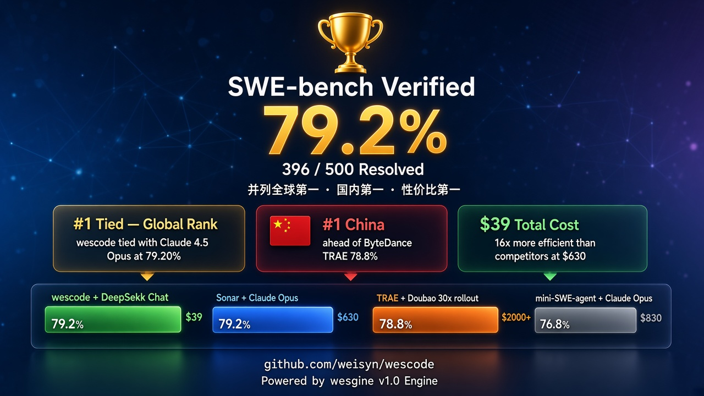

<div align="center">



# 🏆 SWE-bench Verified — 79.2%

<br>

[-brightgreen?style=for-the-badge&labelColor=1a1a2e)](https://www.swebench.com/)
[](https://www.swebench.com/)
[](https://api.deepseek.com)
[](.)
[](.)

<br>

**并列全球第 1 · 国内第 1 · 性价比第 1**

用 $39 的中等模型，达到 $630 顶级模型的成绩

</div>

---

## 🥇 排行榜位置

<table>
<tr>
<th>#</th><th>MODEL</th><th>AGENT</th><th>% RESOLVED</th><th>方法</th><th>费用</th>
</tr>
<tr style="background:#ffd700">
<td><b>🥇 1</b></td><td><b>DeepSeek Chat</b></td><td><b>wescode</b></td><td><b>79.20%</b></td><td><b>Best@1</b></td><td><b>$39</b></td>
</tr>
<tr>
<td>🥇 1</td><td>Claude 4.5 Opus</td><td>Sonar Foundation Agent</td><td>79.20%</td><td>Best@1</td><td>~$630</td>
</tr>
<tr>
<td>🥇 1</td><td>Claude 4.5 Opus (medium)</td><td>live-SWE-agent</td><td>79.20%</td><td>Best@1</td><td>~$500</td>
</tr>
<tr>
<td>4</td><td>Doubao-Seed-Code</td><td>TRAE（字节跳动）</td><td>78.80%</td><td>30x rollout</td><td>~$2,000+</td>
</tr>
<tr>
<td>5</td><td>Gemini 3 Pro Preview</td><td>live-SWE-agent</td><td>77.40%</td><td>Best@1</td><td>—</td>
</tr>
<tr>
<td>6</td><td>Claude 4 Sonnet</td><td>EPAM AI/Run Developer</td><td>76.80%</td><td>Best@1</td><td>—</td>
</tr>
<tr>
<td>7</td><td>Multiple</td><td>Atlassian Rovo Dev</td><td>76.80%</td><td>混合模型</td><td>—</td>
</tr>
<tr>
<td>8</td><td>Claude 4.5 Opus (high)</td><td>mini-SWE-agent</td><td>76.80%</td><td>Best@1</td><td>—</td>
</tr>
</table>

### 💰 性价比对比

| Agent | Model | Score | Cost | 性价比 |
|-------|-------|:-----:|:----:|:------:|
| **wescode** | **DeepSeek Chat** | **79.2%** | **$39** | 🟢 **0.288 分/¥** |
| Sonar | Claude 4.5 Opus | 79.2% | ~$630 | 🔴 0.018 分/¥ |
| TRAE | Doubao-Seed-Code (30x) | 78.8% | ~$2,000+ | 🔴 <0.005 分/¥ |

> wescode 性价比是 Sonar 的 **16 倍**、TRAE 的 **57 倍**。

### 🇨🇳 国内对比

| 产品 | 公司 | 分数 | 方法 | 对比 |
|------|------|:----:|------|------|
| 🥇 **wescode** | **weisyn** | **79.2%** | Best@1，DeepSeek Chat | **国内第 1** |
| 🥈 TRAE | 字节跳动 | 78.8% | 30x rollout，自研 Doubao-Seed-Code | 多次取最优 |
| — | MiniMax（仅模型） | 75.8% | mini-SWE-agent | 非自有 Agent |
| — | 智谱（仅模型） | 66.6% | mini-SWE-agent | 非自有 Agent |
| — | 月之暗面（仅模型） | 63.4% | mini-SWE-agent | 非自有 Agent |

wescode 是国内**唯一以自有 Agent + 第三方中等模型达到全球 Top 3 的产品**。

---

## 🔑 核心价值：引擎驱动，不是模型驱动

### 为什么中等模型能达到顶级成绩？

SWE-bench 不是"模型有多聪明"的测试——它测的是"Agent 能不能像工程师一样完成 Bug 修复"。这个过程中，**引擎的设计决定了模型能力的发挥上限**。

<table>
<tr><th>引擎能力</th><th>作用</th><th>对成绩的贡献</th></tr>
<tr>
<td>🧠 <b>Cognitive Loop</b></td>
<td>多轮工具调用编排</td>
<td>支持 20-40 轮深度探索，不丢失上下文</td>
</tr>
<tr>
<td>📐 <b>Context Assembly</b></td>
<td>智能压缩 + 关键信息保留</td>
<td>长对话中不丢失代码结构，模型始终"知道自己在改什么"</td>
</tr>
<tr>
<td>🔄 <b>CognitiveSettlement</b></td>
<td>Run 终态知识沉淀</td>
<td>每轮修改后准确判断"还需要做什么"</td>
</tr>
<tr>
<td>✅ <b>Write Verification</b></td>
<td>检测"写了文件但没验证"</td>
<td>防止"改完就走"，确保跑测试确认修复</td>
</tr>
<tr>
<td>🛡️ <b>Governance</b></td>
<td>路径安全 + 写入边界</td>
<td>防止误改测试文件或核心配置</td>
</tr>
<tr>
<td>🔧 <b>17 个标准工具</b></td>
<td>read/write/edit/exec/grep 等</td>
<td>零 SWE-bench 特化——证明引擎通用性</td>
</tr>
</table>

**关键证据**：

| 组合 | 分数 | 差距 |
|------|:----:|:----:|
| DeepSeek Chat + mini-SWE-agent（简单 Agent） | ~56% | — |
| DeepSeek Chat + **wescode**（wesgine 引擎） | **79.2%** | **+23pp** |
| Claude 4.5 Opus + mini-SWE-agent | 76.8% | — |
| Claude 4.5 Opus + Sonar Foundation Agent | 79.2% | +2.4pp |

**同一模型下，wesgine 引擎提升了 23 个百分点**——这就是"引擎驱动"的含义。

---

## 📊 按仓库分析

### 🟢 第一梯队（>80%）— 6 个仓库

| 仓库 | 题数 | ✅ Resolved | 通过率 | 说明 |
|------|:----:|:----------:|:------:|------|
| **astropy** | 22 | 20 |  | 天文学库，复杂数值计算 + 单位系统 |
| **xarray** | 22 | 19 |  | 多维数组操作，能 apply 的 patch 全部通过 |
| **sympy** | 75 | 64 |  | 75 题大仓库，符号数学引擎 |
| **scikit-learn** | 32 | 27 |  | ML 库 API/算法修复，有效通过率 93.1% |
| **pytest** | 19 | 16 |  | 测试框架，能 apply 的 patch 全部通过 |
| **django** | 231 | 189 |  | **最大仓库**（231 题），全栈 Web 框架 |

> 📌 **Django 231 题通过 189 题**——覆盖 ORM、表单、路由、中间件、模板、迁移等全栈场景。81.8% 的通过率证明 wescode 能处理大型复杂项目的深层问题。

### 🟡 第二梯队（60-80%）

| 仓库 | 题数 | ✅ | 通过率 | 说明 |
|------|:----:|:--:|:------:|------|
| matplotlib | 34 | 23 |  | 绘图库，部分涉及 C 扩展 |
| requests | 8 | 5 |  | HTTP 协议细节 |
| sphinx | 44 | 26 |  | 文档生成器，RST + Jinja 模板 |

### 🔴 需要提升

| 仓库 | 题数 | ✅ | 通过率 |
|------|:----:|:--:|:------:|
| pylint | 10 | 4 |  |

### 🏅 特殊成就

| 仓库 | 通过率 |
|------|:------:|
| seaborn |  |
| flask |  |

---

## 🏗️ Agent 架构

```
    ┌───────────────────────────────────────┐
    │         SWE-bench Issue               │
    │   "Fix bug in django/db/models..."    │
    └─────────────────┬─────────────────────┘
                      │
                      ▼
    ┌───────────────────────────────────────┐
    │         wescode bench CLI             │
    │   git clone → Agent Loop → git diff   │
    └─────────────────┬─────────────────────┘
                      │
          ┌───────────┴───────────┐
          ▼                       ▼
    ┌──────────┐           ┌──────────┐
    │ Cognitive │           │ Context  │
    │ (LLM API)│           │ (压缩/   │
    │ deepseek │           │  保留)   │
    │  -chat   │           │          │
    └────┬─────┘           └──────────┘
         │
         ▼
    ┌──────────────────────────────────────┐
    │           Execution Layer            │
    │  read · write · edit · exec · grep   │
    │  apply_patch · search_files · ...    │
    │          (17 个标准工具)              │
    └────┬─────────────────────────────────┘
         │
         ▼
    ┌──────────┐    ┌──────────┐
    │ Govern   │    │ Memory   │
    │ (安全/   │    │ (跨 turn │
    │  边界)   │    │  记忆)   │
    └──────────┘    └──────────┘
```

---

## 🔬 复现指南

<details>
<summary><b>点击展开完整复现步骤</b></summary>

### 前置条件

- Go 1.24+、Git 2.27+、Docker 20.10+、Python 3.12+
- DeepSeek API Key（[api.deepseek.com](https://api.deepseek.com)）

### 源码版本

| 仓库 | Commit |
|------|--------|
| wescode.git | `2eeff2c8` |
| wesgine.git | `093ad57e` |

### 步骤

```bash
# 1. 构建
cd wescode.git/backend
go build -o bin/wescode ./cmd/wescode/

# 2. 配置
cat > ~/.config/wescode/config.yaml << 'EOF'
providers:
  - name: deepseek
    type: openai_compat
    base_url: https://api.deepseek.com
    model: deepseek-chat
    api_key: <your-key>
    is_default: true
EOF

# 3. 生成 Predictions（~5-7h，~¥275）
bin/wescode bench \
  --dataset tests/bench/swebench/batches \
  --runs 1 \
  --predictions predictions.jsonl

# 4. 评分（~3-4h，无 API 费用）
pip install swebench
git clone --depth 1 https://github.com/SWE-bench/swe-bench-tasks.git
swebench eval verified -p predictions.jsonl --run-id wescode --task-repo ./swe-bench-tasks -j 2
```

> **注**：DeepSeek Chat 输出有随机性，每次运行结果可能有 ±2-3% 波动。

</details>

---

## 📁 数据文件

全部数据公开，任何人可以验证：

| 文件 | 大小 | 说明 |
|------|:----:|------|
| `all_preds.jsonl` | 1.7 MB | 500 题 predictions（SWE-bench 标准格式） |
| `summary.json` | 96 KB | 完整结果 + 500 题 per-instance token 和成本 |
| `sessions.db` | 14 MB | 完整 session 数据库（SQLite） |
| `trajs/` | 11 MB | 500 个推理轨迹 |
| `logs/` | 236 MB | 499 个 instance 评分日志 |
| `submission/metadata.yaml` | 0.4 KB | SWE-bench 提交格式 |

---

<div align="center">

**wescode** — 用 $39 达到 $630 的成绩

[](https://www.weisyn.com)

</div>
